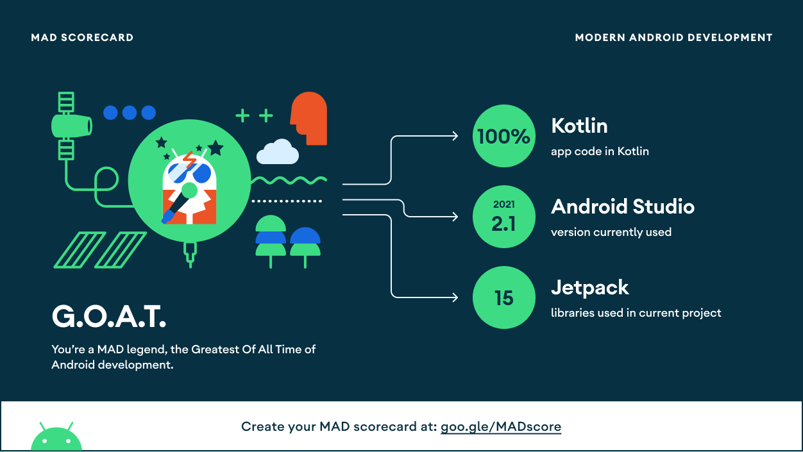
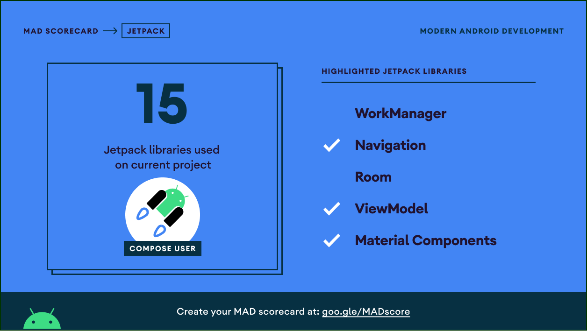
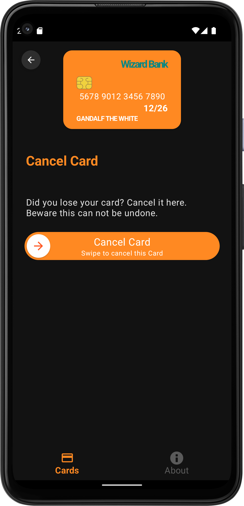

<h1 align="center">MyCards</h1>

<p align="center">
  <a href="https://opensource.org/licenses/Apache-2.0"></a>
  <a href="https://android-arsenal.com/api?level=24"></a>
  <a href="https://github.com/Kuruchy/MyCards/actions"></a>
</p>

<p align="center">  
🔥 MyCards is a small demo application that demonstrates modern Android Architecture based on MVVM. It uses Hilt, Coroutines, Flow, StateFlow, ViewModel, Jetpack Compose and Accompanist.
</p>

## Tech stack & Open-source libraries
- Minimum SDK level 24
- [Kotlin](https://kotlinlang.org/) based, [Coroutines](https://github.com/Kotlin/kotlinx.coroutines) + [Flow](https://kotlin.github.io/kotlinx.coroutines/kotlinx-coroutines-core/kotlinx.coroutines.flow/) + [StateFlow](https://kotlin.github.io/kotlinx.coroutines/kotlinx-coroutines-core/kotlinx.coroutines.flow/-state-flow/) for asynchronous.
- [Hilt](https://dagger.dev/hilt/) for dependency injection.
- Jetpack
    - Compose - Android’s modern toolkit for building native UI. It simplifies and accelerates UI development on Android.
    - Lifecycle - Observe Android lifecycles and handle UI states upon the lifecycle changes.
    - ViewModel - Manages UI-related data holder and lifecycle aware. Allows data to survive configuration changes such as screen rotations.
    - Navigation - Navigation component helps with the implementation of navigation.
- Architecture
    - MVVM Architecture - (Model - View - ViewModel)
    - UDF - Unidirectional Data Flow
    - Repository Pattern

## MAD Score




## Architecture
MyCards is based on the MVVM architecture and the Repository pattern, following the Unidirectional Data Flow.


## Screenshots Darkmode
<table>
    <tr>
        <td></td>
        <td></td>
    </tr>
</table>

## Screenshots Lightmode
<table>
    <tr>
        <td></td>
        <td></td>
    </tr>
</table>

## Detail View
<table>
    <tr>
        <td></td>
        <td></td>
    </tr>
</table>


# License
```xml
Designed and developed by 2021 Kuruchy (Bruno Retolaza)

Licensed under the Apache License, Version 2.0 (the "License");
you may not use this file except in compliance with the License.
You may obtain a copy of the License at

   http://www.apache.org/licenses/LICENSE-2.0

Unless required by applicable law or agreed to in writing, software
distributed under the License is distributed on an "AS IS" BASIS,
WITHOUT WARRANTIES OR CONDITIONS OF ANY KIND, either express or implied.
See the License for the specific language governing permissions and
limitations under the License.
```